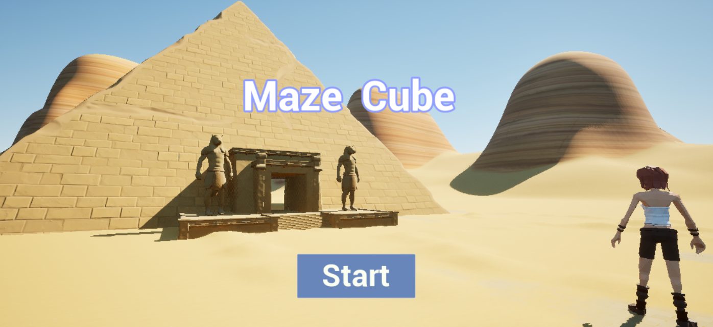
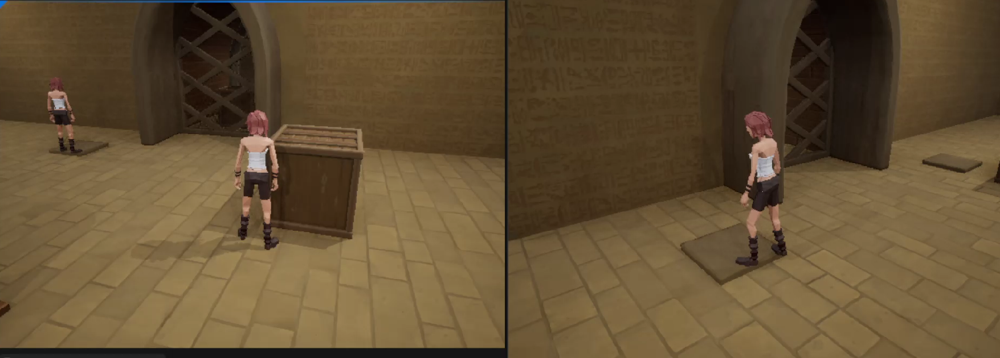
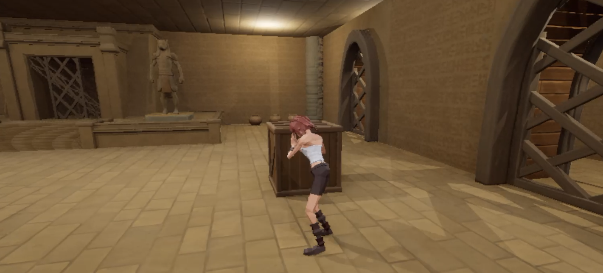
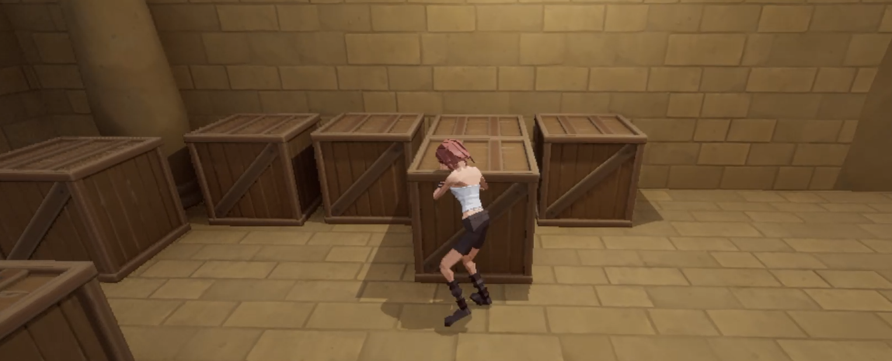
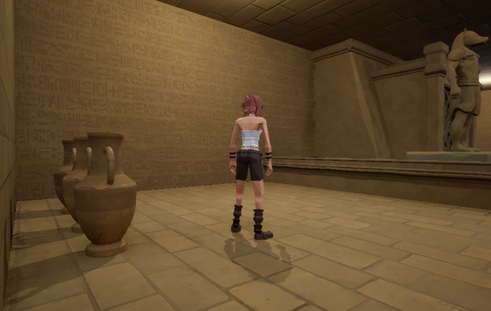
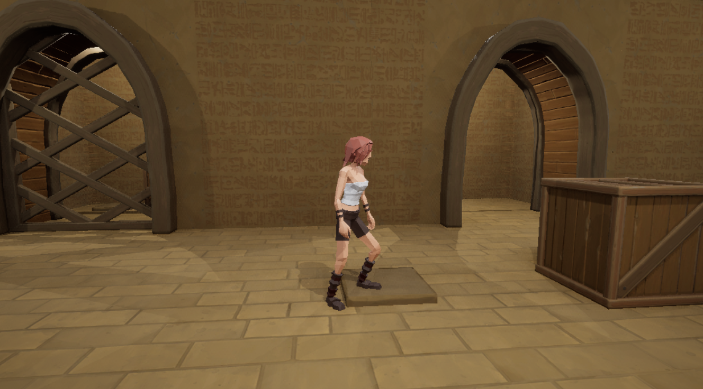

# 🕹️ Cube Escape：多人同步推箱子解謎

這是一款使用 **Unreal Engine 5 (UE5)** 製作的 3D 解謎遊戲，可單人與多人遊玩。推動與碰撞邏輯皆由伺服器驗證與同步。

---

## 🎮 遊戲玩法

- **核心機制：** 玩家需推動地圖上的箱子，利用箱子來觸發機關，最終逃離迷宮。
- **機關互動：** 地圖包含壓力板閘門，玩家必須將箱子推到正確的壓板上，才能升起閘門並解鎖通路。
- **多人同步：** 支援兩位玩家同時連線，共同協作或分工解謎。玩家之間的動作與箱子狀態保持精確同步。
- **沉浸體驗：** 具備遊戲封面、開始選單 UI，以及背景音樂，提供完整的遊戲流程與體驗。

---

## 💡 技術

本專案的核心目標是實踐穩定的多人連線體驗，技術細節皆以網路遊戲開發標準實作：

**網路程式設計** 所有箱子的推動、移動、碰撞及機關觸發邏輯，皆由 **Server 端判斷**並廣播給所有 Client，確保同步的準確性與一致性。 |
**移動與碰撞系統** 實作精確的**前後左右移動**邏輯；設計**碰撞判定**系統，有效解決基於座標移動時可能發生的穿牆或錯誤位移問題。 |
**邏輯判斷** | **推動判定：** 玩家在推動前進行判定，確保只有箱子物件可被推動。 |
|**遊戲流程與動畫** | 實作箱子被推動時的**動畫演出**；包含完整的遊戲載入流程 (封面 → 遊戲畫面)。 |

---

## 📱 支援平台

遊戲支援 **Windows PC 版本**

---

## 📂 專案結構簡介

- `Content/`：主要資源（關卡地圖、藍圖、材質、動畫等）
- `Blueprints/`：所有核心邏輯藍圖（角色控制、箱子、機關、網路同步邏輯）
- `UMG/`：使用者介面相關資源（封面）
- `Maps/`：遊戲關卡地圖檔案
- `README.md`：本專案說明文件

---

## 🛡️ License

本專案所有原始碼與素材均為作者所有，未經明確書面授權，禁止任何形式的商業使用、重新發布、複製或改作。

非經作者授權，不得將本專案用於個人、商業、學習或教學等任何用途，亦不得以任何形式公開分享或散布本專案檔案。

詳細授權條款請參閱專案根目錄的 LICENSE 文件。

---

## 🔧 開發環境

- **遊戲引擎：** Unreal Engine 5
- **程式語言：** Blueprints
- **支援平台：** Windows Build

---

## 🖼️ 遊戲畫面預覽

（請替換成您的 UE5 截圖，特別是**多人同步並排畫面**）

📦 遊戲封面與開始畫面 UI

🤝 多人同步遊戲畫面 (Server & Client 並排)

🧩 推箱子

🧩 場景

🧩 壓板觸發閘門機關

---

## 🎬 遊戲影片展示

👉 [遊戲展示影片 https://youtu.be/Eg-CpmfjNzw
👉 [遊戲展示影片 https://youtu.be/BNNrTVQYpgk

---

## 👨‍💻 作者

- GitHub 帳號：123Ryo
